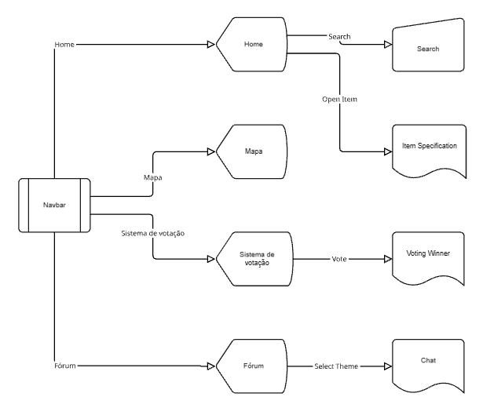

# Introdução

Informações básicas do projeto.

* **Projeto:** DDD031
* **Repositório GitHub:** [Repositório do Github](https://github.com/ICEI-PUC-Minas-PPLCC-TI/ti1-grp-lugares-para-role)
* **Membros da equipe:**

  * [Alex Marques](https://github.com/AlexMarques00)
  * [Matheus Akl](https://github.com/Akl372)
  * [Júlia Michetti](https://github.com/juliaagainagain)

A documentação do projeto é estruturada da seguinte forma:

1. Introdução
2. Contexto
3. Product Discovery
4. Product Design
5. Metodologia
6. Solução
7. Referências Bibliográficas

✅ [Documentação de Design Thinking (MIRO)](files/processo.pdf)

# Contexto

Detalhes sobre o espaço de problema, os objetivos do projeto, sua justificativa e público-alvo.

## Problema

Jovens de 18 a 30 anos enfrentam dificuldade em encontrar, de forma prática e centralizada, locais acessíveis para lazer e socialização em sua cidade. As informações disponíveis estão fragmentadas entre diferentes fontes, como redes sociais, blogs e aplicativos, o que exige tempo e esforço para pesquisa.

Além disso, muitas plataformas priorizam eventos pagos e grandes atrações, deixando em segundo plano locais cotidianos que podem oferecer experiências de convívio mais acessíveis. Essa ausência de um meio unificado de consulta gera perda de tempo, limita o acesso a opções diversificadas e dificulta a descoberta de novos espaços de lazer.

## Objetivos

### Objetivo Geral

Desenvolver uma plataforma web que centralize informações sobre opções de lazer e convivência urbana, facilitando para jovens de 18 a 30 anos a descoberta de locais acessíveis, sem necessidade de compra antecipada de ingressos.

### Objetivos Específicos

Criar uma interface simples e intuitiva para busca de locais.

Permitir filtros de pesquisa por tipo de local, faixa de preço e localização.

Organizar informações de forma clara e acessível sobre cafés, bares, restaurantes e praças.

Facilitar a interação por meio de avaliações e comentários de usuários.

Valorizar a cultura local ao destacar opções de lazer diversificadas.

## Justificativa

A relevância deste projeto se dá pela crescente necessidade dos jovens de encontrarem opções de lazer acessíveis, rápidas de localizar e que promovam interação social. Em um contexto em que grande parte das informações está dispersa em múltiplos canais digitais, oferecer uma plataforma unificada representa ganho de tempo e praticidade.

Do ponto de vista social, a iniciativa contribui para estimular a ocupação de espaços urbanos, promover a convivência e apoiar pequenos negócios locais. Do ponto de vista acadêmico, o projeto possibilita aplicar conhecimentos de desenvolvimento web, banco de dados e experiência do usuário (UX), integrando teoria e prática.

Assim, a proposta é justificada tanto pela sua utilidade real no cotidiano dos jovens quanto pelo seu valor pedagógico na formação dos estudantes envolvidos no desenvolvimento.

## Público-Alvo

O público-alvo principal são jovens de 18 a 30 anos que utilizam ativamente tecnologias digitais no dia a dia. Trata-se de um grupo composto por:

- **Universitários** em busca de lazer acessível e socialização.

- **Jovens profissionais** que dispõem de tempo limitado e valorizam praticidade.

- **Usuários de tecnologia** com familiaridade em aplicativos e sites de busca, que esperam interfaces intuitivas e rápidas.

Esse público tende a buscar experiências autênticas, econômicas e diversificadas, valorizando tanto ambientes urbanos tradicionais quanto novos espaços de convivência. Além disso, são usuários que confiam em recomendações de pares, o que reforça a importância de incluir avaliações e comentários na solução.

# Product Discovery

## Etapa de Entendimento

### Matriz CSD

| **Certezas** | **Suposições** | **Dúvidas** |
|--------------|----------------|-------------|
| Jovens de 18 a 30 anos usam a internet para procurar opções de lazer. | O público prefere locais gratuitos ou de baixo custo em vez de eventos pagos. | Quais critérios os jovens mais valorizam na hora de escolher onde sair (preço, localização, ambiente)? |
| As informações sobre lugares estão dispersas em diferentes plataformas. | Ter avaliações de outros usuários aumenta a confiança na escolha. | Qual a melhor forma de classificar e filtrar os locais (categorias, notas, proximidade)? |
| Muitos aplicativos de lazer priorizam eventos com ingresso. | A simplicidade da interface pode ser um diferencial competitivo. | O público aceitaria contribuir ativamente com avaliações e fotos dos locais? |

### Mapa de stakeholders

- **Usuários principais**: jovens entre 18 e 30 anos (universitários, jovens profissionais, turistas).

- **Stakeholders secundários**: donos de cafés, bares, restaurantes e outros estabelecimentos.

- **Stakeholders de suporte**: desenvolvedores do sistema, equipe de design, universidade (orientadores).

- **Influenciadores indiretos**: blogs locais, guias culturais, redes sociais.

### Entrevistas qualitativas

- Muitos jovens relatam gastar muito tempo pesquisando opções de lazer em diferentes plataformas.

- O fator preço acessível é decisivo na escolha.

- A localização próxima e a ambiente acolhedor são critérios muito mencionados.

- A ausência de informações confiáveis e atualizadas causa frustração.

### Highlights de pesquisa

- Existe demanda por centralização de informações.

- Usuários querem simplicidade na busca de locais.

- Avaliações e comentários são elementos-chave para gerar confiança.

- Há oportunidade de promover pequenos negócios locais.

## Etapa de Definição

### Personas

#### Persona 1 – João
- **Idade**: 20 anos  
- **Local**: Belo Horizonte, MG  
- **Hobby**: Esporte  
- **Trabalho**: Universitário  
- **Personalidade**: Gosta de conhecer novas pessoas, gosta muito da vida noturna e adora sair com os amigos.  
- **Sonhos**: Viajar para a Europa e tornar-se jogador de futebol.  
- **Objetos e lugares**: Utiliza muito as redes sociais; todo fim de semana sai para festas e bares.  
- **Objetivos-chave**: Conhecer lugares em alta de BH, novos estabelecimentos, opções para um pós-rolê e para sair com amigos.  
- **Como devemos tratá-lo**: Oferecer experiências sociais dinâmicas, com foco em interação com amigos.  

---

#### Persona 2 – Ana
- **Idade**: 22 anos  
- **Local**: Belo Horizonte, MG  
- **Hobby**: Tocar violão  
- **Trabalho**: Universitária  
- **Personalidade**: Reservada, não gosta de multidão, leal aos amigos.  
- **Sonhos**: Estudar para se tornar astróloga.  
- **Objetos e lugares**: Usa muito notebook e celular para faculdade; estuda à tarde em casa.  
- **Objetivos-chave**: Descobrir lugares calmos para sair com amigos, jogar e conversar.  
- **Como devemos tratá-la**: Priorizar ambientes tranquilos, acolhedores e que estimulem boas conversas.  

---

#### Persona 3 – Gabriel
- **Idade**: 24 anos  
- **Local**: Belo Horizonte, MG  
- **Hobby**: Fotografia  
- **Trabalho**: Influencer  
- **Personalidade**: Curioso, gosta de sair e de conhecer novos lugares.  
- **Sonhos**: Trabalhar remunerado apenas com mídia social.  
- **Objetos e lugares**: Planeja ir a lugares “instagramáveis”; busca restaurantes e pontos turísticos da cidade.  
- **Objetivos-chave**: Conhecer lugares em alta na cidade e a cultura de BH.  
- **Como devemos tratá-lo**: Destacar locais modernos e populares, com apelo visual para redes sociais.  

# Product Design

## Histórias de Usuários

Com base nas personas identificadas:

| EU COMO... (Persona) | QUERO/PRECISO (Funcionalidade) | PARA (Motivo/Valor) |
|--------------------------------|---------------------------------------------------|-------------------------------------------------------------------|
| Usuário em geral | Encontrar bares e festas populares na região | Para sair com amigos todo fim de semana sem perder tempo procurando |
| Usuário em geral | Descobrir lugares calmos, como cafés e praças | Para ter momentos tranquilos com amigos sem multidão |
| Usuário em geral | Ver recomendações de lugares “instagramáveis” | Para criar conteúdo e atrair engajamento em suas redes sociais |
| Usuário em geral | Filtrar lugares por categoria (bar, restaurante, praça, café) | Para encontrar rapidamente o tipo de rolê que deseja |
| Usuário em geral | Salvar lugares favoritos | Para revisitar ou recomendar para amigos |
| Usuário em geral | Visualizar avaliações e comentários de outros usuários | Para decidir se o lugar vale a pena antes de ir |

---

## Proposta de Valor

### Persona João
- **Ganhos:** Encontrar lugares novos e em alta; facilidade para combinar com amigos.  
- **Dores:** Dificuldade de descobrir novidades; perde tempo pesquisando em várias redes.  
- **Produtos/Serviços:** Sugestão de bares, pubs e eventos sociais de forma simples e centralizada.  

### Persona Ana
- **Ganhos:** Tranquilidade, espaços seguros e confortáveis; opções fora do agito.  
- **Dores:** Não gosta de multidões; dificuldade em achar locais mais reservados.  
- **Produtos/Serviços:** Filtros para lugares calmos, como cafés, praças e restaurantes aconchegantes.  

### Persona Gabriel
- **Ganhos:** Encontrar pontos turísticos e restaurantes instagramáveis.  
- **Dores:** Gasta tempo demais pesquisando onde tirar fotos legais.  
- **Produtos/Serviços:** Lista de lugares populares e “fotogênicos”, com imagens e destaques.  

---

## Requisitos

### Requisitos Funcionais

| ID | Descrição do Requisito | Prioridade |
|---------|---------------------------------------------------------------------------------------|------------|
| RF-001 | O sistema deve apresentar uma tela inicial com opções de navegação (Home, Cafés, Dates, Turma, Amigos, Fórum). | ALTA |
| RF-002 | O sistema deve permitir a busca de lugares por meio de uma barra de pesquisa. | ALTA |
| RF-003 | O sistema deve exibir uma seção de "Descobertas em Destaque", com fotos e descrição de locais. | ALTA |
| RF-004 | O sistema deve listar lugares categorizados em Cafés, Dates, Turma e Amigos. | ALTA |
| RF-005 | O sistema deve permitir ao usuário visualizar fotos, descrições e horários dos lugares sugeridos. | ALTA |
| RF-006 | O sistema deve disponibilizar a funcionalidade "Decidir com os Amigos", permitindo comparar diferentes opções de locais. | MÉDIA |
| RF-007 | O sistema deve permitir que o usuário selecione e destaque locais de interesse para avaliação em grupo. | MÉDIA |
| RF-008 | O sistema deve oferecer um espaço de Fórum para discussões e troca de opiniões sobre locais. | MÉDIA |
| RF-009 | O sistema deve possuir design responsivo, adaptando as telas para desktop e mobile. | ALTA |
| RF-010 | O sistema deve possuir botão de retorno em páginas internas na versão mobile. | MÉDIA |
| RF-011 | O sistema deve exibir sugestões personalizadas por categorias (ex.: Cafés mais populares, lugares para casal, etc.). | ALTA |
| RF-012 | O sistema deve exibir a localização dos lugares em um mapa interativo (ex.: integração com Google Maps ou OpenStreetMap). | ALTA |
| RF-013 | O sistema deve permitir salvar locais como favoritos para futura referência ou recomendação. | MÉDIA |
| RF-014 | O sistema deve permitir que o usuário veja avaliações e comentários de outros usuários. | ALTA |

### Requisitos Não Funcionais

| ID | Descrição do Requisito | Prioridade |
|---------|--------------------------------------------------------------|------------|
| RNF-001 | O sistema deve ser responsivo e funcionar em desktop e dispositivos móveis. | ALTA |
| RNF-002 | O sistema deve utilizar design intuitivo e acessível, compatível com boas práticas de UX. | MÉDIA |
| RNF-003 | O sistema deve garantir segurança dos dados do usuário, incluindo favoritos e comentários. | ALTA |
| RNF-004 | O sistema deve permitir integração com APIs externas de mapas e redes sociais. | MÉDIA |


## Projeto de Interface

Artefatos relacionados com a interface e a interacão do usuário na proposta de solução.

### Wireframes

Estes são os protótipos de telas do sistema.


### User Flow



### Protótipo Interativo

✅ [Protótipo Interativo](https://www.figma.com/proto/8j6xUIeRAEtm53Yq6iIHLi/DDD031?node-id=0-1&t=A9IcXOHRaSVkH5wh-1) 

# Metodologia

Detalhes sobre a organização do grupo e o ferramental empregado.

## Ferramentas

Relação de ferramentas empregadas pelo grupo durante o projeto.

| Categoria | Ferramenta / Plataforma | Link de acesso | Justificativa de Uso |
| -------------------------- | --------------------- | ------------------------------------------------- | ---------------------------------------------------------------------------------------------------- |
| Processo de Design Thinking | Miro | [https://miro.com/app/board/uXjVJPwuiUc=](https://miro.com/app/board/uXjVJPwuiUc=) | Criação de quadros colaborativos para brainstorming, definição de personas, jornadas do usuário e wireframes iniciais. |
| Repositório de Código | GitHub | [https://github.com/ICEI-PUC-Minas-PPLCC-TI/ti1-grp-lugares-para-role](https://github.com/ICEI-PUC-Minas-PPLCC-TI/ti1-grp-lugares-para-role) | Controle de versão, organização do código-fonte e colaboração entre membros do grupo. |
| Protótipos de Interface | Figma | [https://www.figma.com/design/8j6xUIeRAEtm53Yq6iIHLi/DDD031?node-id=0-1&p=f&t=BiLYBvrGXiQoeusC-0](https://www.figma.com/design/8j6xUIeRAEtm53Yq6iIHLi/DDD031?node-id=0-1&p=f&t=BiLYBvrGXiQoeusC-0) | Criação de wireframes e protótipos interativos, com colaboração em tempo real e exportação de layouts. |
| Comunicação e Planejamento | Discord / WhatsApp | N/A | Comunicação rápida entre membros do grupo, compartilhamento de arquivos e discussões sobre tarefas. |

## Gerenciamento do Projeto

Esta seção apresenta a organização do grupo, a divisão de papéis, o processo de trabalho baseado em metodologias ágeis e a estrutura de controle de tarefas.

O projeto foi conduzido utilizando uma abordagem **ágil**, com foco na entrega contínua de valor e na adaptação a mudanças. Embora o projeto não tenha detalhado o uso de *sprints* formais, a estrutura de papéis e a divisão de tarefas por funcionalidades indicam uma organização típica de equipes de desenvolvimento.

O grupo definiu papéis claros para cada membro, alinhando responsabilidades e tarefas, conforme a tabela a seguir:

| Responsável | Principais Responsabilidades |
|-----------------|-------------------------------------------------------------------------------------------------------------|
| **Alex Marques** | Desenvolvimento da tela **Home (Discovery)**, exibindo locais em destaque, sugestões personalizadas e integração com mapas. |
| **Matheus Akl** | Implementação da tela **Search** e **Fórum**, incluindo barra de busca, filtros por tipo de lugar, e discussões de usuários. |
| **Júlia Michetti** | Criação das telas **Turma** e **Dates** (Match/Roulette), com comparação de opções, votação de lugares em grupo e funcionalidades de sugestão aleatória. |
| **Equipe** | Implementação das telas de **Login/Cadastro** e **Configurações**, garantindo autenticação, segurança, edição de perfil e preferências do usuário. |

# Solução Implementada

Esta seção apresenta todos os detalhes da solução criada no projeto.

## Funcionalidades

A solução implementada, denominada **DDD 031**, é uma plataforma web que centraliza informações de lazer em Belo Horizonte, focada no público jovem. As principais funcionalidades são:

##### Funcionalidade 1 - Busca e Descoberta de Locais

Permite ao usuário encontrar locais de lazer através de uma barra de pesquisa e filtros por categoria (Cafés, Bares, Parques, etc.). A tela inicial exibe um carrossel de **"Descobertas em Destaque"** e listas de locais agrupados por categorias, facilitando a navegação e a descoberta de novos *rolês*.

* **Estrutura de dados:** [Places](#ti_ed_places)
* **Instruções de acesso:**
  * Acesse a página inicial (`index.html`).
  * Utilize a barra de pesquisa no topo da página ou navegue pelas categorias.

##### Funcionalidade 2 - Sistema de Favoritos

Permite que o usuário salve locais de interesse para referência futura. Os favoritos são persistidos localmente por usuário, garantindo que cada um tenha sua lista personalizada.

* **Estrutura de dados:** [Usuários](#ti_ed_usuarios) (para identificação) e lista de IDs de `places` no `localStorage`.
* **Instruções de acesso:**
  * Na página de detalhes de um local, clique no ícone de coração para adicionar/remover dos favoritos.
  * Acesse a página **Favoritos** (`favorites.html`) para gerenciar a lista.

##### Funcionalidade 3 - Fórum de Discussão

Oferece um espaço para a comunidade trocar opiniões, fazer perguntas e dar dicas sobre os locais de lazer. A funcionalidade é baseada em *threads* (tópicos) e *posts* (comentários).

* **Estrutura de dados:** [Threads](#ti_ed_threads) e [Posts](#ti_ed_posts)
* **Instruções de acesso:**
  * Acesse a página **Fórum** (`forum.html`).
  * Crie um novo tópico ou comente em tópicos existentes.

##### Funcionalidade 4 - Sugestão de Rolês (Match/Roulette)

Funcionalidades de apoio à decisão, como a **"Decidir com os Amigos"** (`match.html`) e a **"Roleta"** (`roulette.html`), que ajudam o usuário a comparar opções ou a receber uma sugestão aleatória de local para sair.

* **Estrutura de dados:** [Places](#ti_ed_places)
* **Instruções de acesso:**
  * Acesse a página **Match** ou **Roulette** no menu de navegação.

## Estruturas de Dados

Descrição das estruturas de dados utilizadas na solução, com exemplos no formato JSON extraídos do `db/db.json`.

##### Estrutura de Dados - Places <a id="ti_ed_places"></a>

Representa os locais de lazer cadastrados na plataforma.

```json
  {
    "id": 1,
    "nome": "Praça da Liberdade",
    "descricao": "Um icônico complexo paisagístico e arquitetônico, cercado por museus e centros culturais.",
    "endereco": "Praça da Liberdade, s/n - Savassi, Belo Horizonte",
    "latitude": -19.932,
    "longitude": -43.9387,
    "rating": 4.8,
    "ratings": 234,
    "image": "https://blog.blablacar.com.br/wp-content/uploads/2024/04/bh-praca-da-liberdade-5.webp",
    "tags": [
      "parque"
    ],
    "destaque": true
  }
```

##### Estrutura de Dados - Usuários <a id="ti_ed_usuarios"></a>

Registro dos usuários do sistema, utilizados para login e personalização (como a lista de favoritos).

```json
  {
    "id": 1,
    "login": "admin",
    "senha": "123",
    "nome": "Administrador do Sistema",
    "email": "admin@abc.com"
  }
```

##### Estrutura de Dados - Threads <a id="ti_ed_threads"></a>

Representa os tópicos de discussão no Fórum.

```json
  {
    "title": "Melhores bares na Savassi",
    "content": "Quais bares vocês recomendam na Savassi para um rolê tranquilo?",
    "authorId": null,
    "authorName": "Anônimo",
    "category": "Geral",
    "tags": ["#dica", "#pergunta"],
    "views": 12,
    "createdAt": "2025-12-06T17:25:00.000Z",
    "id": 2
  }
```

##### Estrutura de Dados - Posts <a id="ti_ed_posts"></a>

Representa os comentários dentro de cada tópico (*thread*) do Fórum.

```json
  {
    "threadId": 2,
    "content": "222 e Nada Contra são ótimos para começar a noite.",
    "authorId": null,
    "authorName": "Alex",
    "createdAt": "2025-12-06T17:30:00.000Z",
    "id": 2
  }
```

## Módulos e APIs

Esta seção apresenta os módulos e APIs utilizados na solução.

| Categoria | Módulo / API | Justificativa de Uso |
| -------------------------- | --------------------- | ---------------------------------------------------------------------------------------------------- |
| **Backend / API Mock** | `json-server` (Node.js) | Utilizado para criar uma API REST *mock* de forma rápida, servindo os dados do `db.json` e simulando as operações CRUD necessárias para o frontend. |
| **Servidor Web** | `express` (Node.js) | Utilizado em conjunto com o `json-server` para servir os arquivos estáticos (HTML, CSS, JS) da aplicação. |
| **Frontend** | HTML5, CSS3, JavaScript | Tecnologias base para a construção da interface de usuário e lógica de interação no lado do cliente. |
| **Mapeamento** | API de Mapas (Ex: Google Maps/OpenStreetMap) | Necessário para a funcionalidade de mapa interativo (`map.html`) e para exibir a localização exata dos locais (RF-012). |
| **Ícones** | Font Awesome (Inferido) | Biblioteca de ícones comumente utilizada para elementos de interface como favoritos, busca e navegação. |